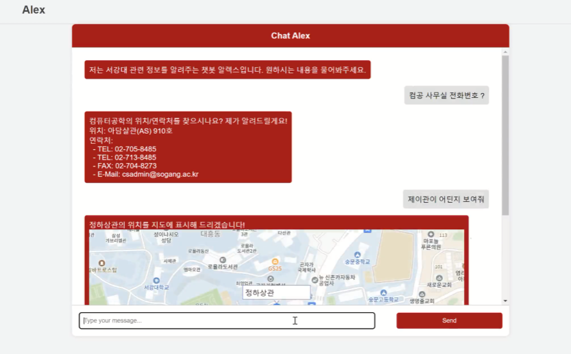
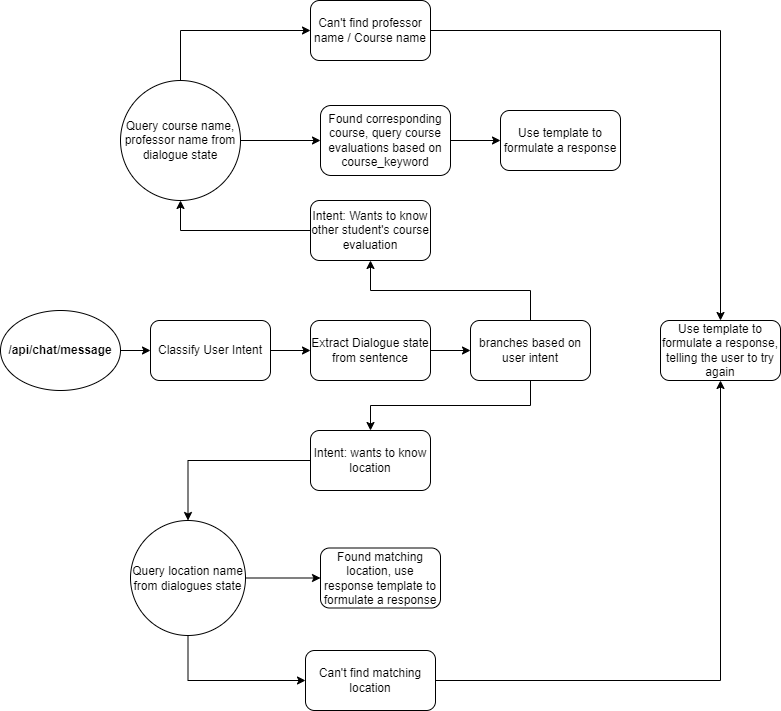

# Design Document
## Overview
- A Task Oriented Dialogue System Chatbot for Sogang University Freshmen


## Goals
- Fast, Low cost
    - Used the smallest ai model possible
- Extensible


## Structure of Files

```
|-- chatapp/
|   |-- actions/             
|   |-- responses/           
|   |-- db/                  
|   |-- api_server.py        
|   |-- intent_models.py    
|   |-- response.py         
|   |-- state_models.py      
|-- config/                  
|-- data/                   
|-- models/                
|-- vector_data/          
|-- logs/                
|-- insert_into_sqlite_db.py 
|-- wsgi.py                 
```

## Example of processing user input

## Pipeline of processing user input
- One endpoint in api_server.py (/api/chat/message)
1. Figures out user intent 
2. Figures out dialogue state
3. Formulates response

``` python
    # Inside api_server.py
    cur_intent1 = intent1(user_text)
    cur_intent2 = intent2(user_text, cur_intent1)
    add_slot = state(user_text, cur_intent1, cur_intent2)
    cur_slot = cur_slot | add_slot
    response_text = response(cur_intent2, cur_slot)
```
- Dialogues state is recorded as "slots"
    - An action could require specific slots of a dialogue.
- In a complicated TOD system, getting dialogue state is done by analyzing the whole dialogue. 
    - This is because the user can reference what he has said before while chatting
- In this application, we only analyze one user input, not the whole dialogue
    - We chose to use a NER model, which can identify entities in a sentence
    - This doesn't figure out what dialogue state to use in a specific intent.
    - In a dialogue situation, we keep all entities by unioning them. (Union of cur_slot and add_slot)
        - It helps the system reference past information from the dialogue
        - Disadvantage
            - It could reference past information, even if the user didn't intend to do it. The user might have just not included enough information for the action, instead of relying on past dialogue information.
        - Reasons for choosing this design:
            - All the actions performed by the chatbot is getting information.
            - The side-effects of getting information is minimal
            - If the chatbot could important actions related to writing information, this design choice would be bad, because it could perform unwanted actions.
            - e.g.) The chatbot could output unwanted information, but the user would know the information isn't what he wanted, so he would give additional information.


### Intent Classification
- Used a dedicated class for classifying intent
- Uses pipeline function provided by huggingface transformers
- Regarding concurrency
    - Gunicorn workers have does not share objects
    - Default gunicorn workers handles requests in a sequential manner
    - So, concurrency issues in using huggingface models is not a concern
        - + also, pytorch models are thread-safe in a inference context (not tracking gradients)
        - (Couldn't figure out if pipelines from huggingface is the same)
        - If concurrency issues aries by changing worker type, we have to create a custom pipeline using pytorch.
``` python
# Inside intent_models.py
# Intent2 class is similar
class Intent1:
    ...
    def __call__(self, user_text):
        intent1_s = self.classifier(user_text)[0]["label"]
        intent1 = self._stoi1(intent1_s)

        return intent1
    ...
```

### Dialogue State
- Used a dedicated class for retrieving dialogue state
- Tried two methods of getting dialogue state
    - Seq2Seq: Poor performance. Seq2Seq models generally require much data to train.
    - NER: Moderate performance. Can identify entities at about 90% accuracy
- In the end, we decide to use a NER model, which classifies tokens in a sentence
- All the methods should implement get_slot, defined in a abstract class "StateModels"

``` python
class StateModels:
    @abstractmethod
    def get_slot(self, user_text, intent1, intent2) -> dict:
        ...

class NERState(StateModels):
    ...
    def __call__(self, user_text, _intent1, _intent2) -> dict:
        slot = {}
        classified = self.classifier(user_text)
        for group in classified:
            slot[group["entity_group"]] = group["word"]
        return slot
```

### Response
#### Registering Callback based on Intent
- Callback functions are registered in chatapp/response.py
- The appropriate function is called based on intent

``` python
handlers = {
    Intent2.COURSE_EVALUATION: course_evaluation_response,
    Intent2.COURSE_INFORMATION: course_information_response,
    ...
}

class ChatResponse:
    def __call__(self, intent2, slot):
        try:
            for handler_intent2, func in handlers.items():
                if handler_intent2 == intent2:
                    return func(slot)

            return "no response made yet"
        except e:
            logging.error(e)
            return "Error in handling chat response"
```

#### Actions
- Callback functions are in chatapp/actions/
- Are organized by situations
- e.g.) If the user intent is searching for course information, the related functions are in actions/course/course_information.py
- Performs DB queries, and according to the result, branches on to each situation
- All branch functions are defined in the same file

``` python
def course_information_response(slot):
    client = VecDB()
    course, professor = client.query_course_professor(
        slot.get("course"), slot.get("professor")
    )

    # query about course + professor
    if course and professor:
        return _course_and_professor(course, professor)
    # query all about course
    elif course:
        return _course_all(course)
    # query all about professor
    elif professor:
        return _professor_all(professor)
    # Nothing known
    else:
        return _course_none_professor_none()
```

#### Actual Responses
- Actual responses are present in responses/
- Provides a function for selecting responses
- Given a relative path, selects a response from the provided .toml file

``` python
class SelectResponse:
    def get_response(self, path, variables={}):
        try:
            base = pathlib.Path(os.path.dirname(os.path.realpath(__file__)))
            with open(base / (path + ".toml"), "rb") as f:
                response = tomllib.load(f)

            for variable_name in response.get("variables", []):
                if variable_name not in variables:
                    raise AttributeError("variables not satisfied")

            chosen_response = random.choice(response.get("utter", []))
            return chosen_response.format(**variables)

        except Exception as e:
            logging.error(e)
            return "Error while selecting response"
```

- Example of using SelectResponse
- Has to provide the correct variables needed to formulate a response
``` python
def _course_not_opened_this_semester(course=None, professor=None):
    ...
    else:
        s = SelectResponse()
        return s.get_response(
            "course/information/not_opened_this_semester",
            {"course": course, "professor": professor},
        )
```

- Structure of the .toml file
    - utter
        - A list of responses that can be selected randomly in a specific situation
        - Multiple responses are needed to make the dialogue more natural.
        - Can use variables specified in "variables"
    - variables
        - A list of variables that can be used in th response
        - In get_response, uses the .format by python to parse the variables in the response
``` toml
utter = [
    """
이번 학기에 {professor} 교수님의 {course} 수업에 대한 정보가 없습니다!""",
    """
다시 한번 확인해 주세요! {professor} 교수님의 {course} 수업이 이번 학기에 안 열리는 것 같습니다!
"""
]

variables = [
    "professor",
    "course"
]
```

## Databases
### Vector Database
- Used Weaviate
    - Selected a DB which had the functionality of running locally.
        - e.g.) Pinecone didn't have the option to run locally
    - Weaviate was production-ready.
        - e.g.) ChromaDB is not production ready.

- Information from Vector DB is used to query again in SQLite
    - Building name, course name, professor name

- Collection Structure (Made by the python v4 api)
    - Created a separate collection for course name, professor name, course, course evaluation
    - Each of them has a text property
    - Didn't link identical data with cross references
        - When querying by using vector similarity search, the DB engine doesn't take consider into references
            - Can only filter by references, but not perform vector similarity search
        - Has to manually construct the vectors, and specify each objects' vectors. 
            - Creates a vector by adding "course name" vector and "professor name" vector
            - Integrity is broken in this step
            - To improve query speed, put identical data in different collections
                - Speed is improven because there is no need to resolve relations
        - Issues with integrity
            - CourseName, ProfessorName, Course, Course Evaluation
            - The data are not linked with references

``` python
{
client.collections.create("CourseName",
                          properties=[
                              wvcc.Property(name="course_name", data_type=wvcc.DataType.TEXT)
                          ])
client.collections.create("ProfessorName",
                          properties=[
                              wvcc.Property(name="professor_name", data_type=wvcc.DataType.TEXT)
                          ])
                          
client.collections.create("Course",
                         properties=[
                             wvcc.Property(name="course_name", data_type=wvcc.DataType.TEXT),
                             wvcc.Property(name="professor_name", data_type=wvcc.DataType.TEXT)
                         ])
client.collections.create("CourseEvaluation",
                          properties=[
                              wvcc.Property(
                                  name="evaluations", 
                                  data_type=wvcc.DataType.TEXT,
                              ),
                              wvcc.Property(
                                  name="course_name", 
                                  data_type=wvcc.DataType.TEXT,
                              ),
                              wvcc.Property(
                                  name="professor_name", 
                                  data_type=wvcc.DataType.TEXT,
                              )
                          ],)


client.collections.create("AddressLocation",
                          properties=[
                              wvcc.Property(name="department_name", data_type=wvcc.DataType.TEXT)
                          ])

client.collections.create("Buildings",
                          properties=[
                              wvcc.Property(name="primary_building_name", data_type=wvcc.DataType.TEXT),
                              wvcc.Property(name="building_name", data_type=wvcc.DataType.TEXT),
                              wvcc.Property(name="coordinates", data_type=wvcc.DataType.GEO_COORDINATES)
                          ])

}
```


### SQLite
- Used for storing tabular data such as buildings, courses, departments
- Joins relevant tables when querying
- Schema for Tables
```
CREATE TABLE building(
  id INTEGER PRIMARY KEY AUTOINCREMENT,
  latitude REAL,
  longitude REAL
);

CREATE TABLE building_names(
  id INTEGER,
  building_name TEXT,
  FOREIGN KEY(id) REFERENCES building(id)
);

CREATE TABLE course (
  id INTEGER PRIMARY KEY,
  major TEXT,
  course_code TEXT,
  division TEXT,
  course_name TEXT,
  credit TEXT,
  time TEXT,
  location TEXT,
  professor TEXT,
  is_english BOOLEAN,
  target_year TEXT,
  recommended_year TEXT
);

CREATE TABLE department(
  id INTEGER PRIMARY KEY AUTOINCREMENT, 
  department_name TEXT
);

CREATE TABLE location(
  id INTEGER,
  location_name TEXT,
  FOREIGN KEY(id) REFERENCES department(id)
);

CREATE TABLE contacts(
  id INTEGER,
  contact_type TEXT,
  contact_value TEXT,
  FOREIGN KEY(id) REFERENCES department(id)
);
```

### Database querying classes
#### VecDB
- All classes in chatapp/db/
- Needs a Embedding model to create vectors
    - One of the largest models in this project.
    - Created as a singleton model, because initializing the model takes a long time
    - Needs to access everytime a query to vector db occurs.
- Creates a new connection every time VecDB class is created
    - For easy management of connections
    - Weaviate doesn't support connection pooling
        - If this becomes the bottleneck of speed, can implement connection pooling


``` python
class EmbeddingModel:
    _instance = None

    @classmethod
    def getInstance(cls):
        if cls._instance == None:
            cls._instance = SentenceTransformer("jhgan/ko-sroberta-multitask")
        return cls._instance

class VecDB:
    def __init__(self):
        self.connection = weaviate.connect_to_local(port=8080, grpc_port=50051)
        self.embedding_model = EmbeddingModel.getInstance()

    def __del__(self):
        self.connection.close()

    ...
    # individual query functions
```

#### MapDB
- Uses just .pkl file for accessing the path graph for sogang university
- Considered using a graph database.
    - The data is too small to introduce a new overhead 
    - No further plans to add to the route information
- Uses KDTree to find the closest node
    - When calculating path from one building from another, uses the closest node to a building
``` python
class MapDB:
    def __init__(self):
        with open(config.get_db_path("map"), "rb") as f:
            self.graph = pickle.load(f)

        self.nodes = list(self.graph.nodes(data=True))
        kdtree_data = list(map(lambda x: [x[1]["y"], x[1]["x"]], self.nodes))
        self.kdt = KDTree(kdtree_data)

```

#### CourseDB, DepartmentDB
- Opens a connection to SQLite .db file everytime this object is created
    - SQLite connection has low overhead
    - Unless SQLite is compiled to support multithread environment, sharing a connection between threads is not possible
``` python
class CourseDB:
    def __init__(self):
        self.connection = sqlite3.connect(config.get_db_path("course"))
    ...
    # query functions
```

# Major References
- Simple TOD : https://arxiv.org/abs/2005.00796
    - Used to get a general understanding of TOD systems
    - Inspired from this, tried getting dialogue state using a seq2seq system (Although the system from this paper does everything needed in a TOD system at once wih a seq2seq model)
- 챗봇을 위한 대화는 어떻게 디자인할까 : https://d2.naver.com/helloworld/2110494
    - Helped in modeling the dialogue task-by-task
    - Created a abstraction for actions and response
- Rasa Docs: https://rasa.com/docs/rasa/
    - Rasa is a open-source system for modeling chatbots
    - Got inspiration on how to structure responses the chatbot could make.

